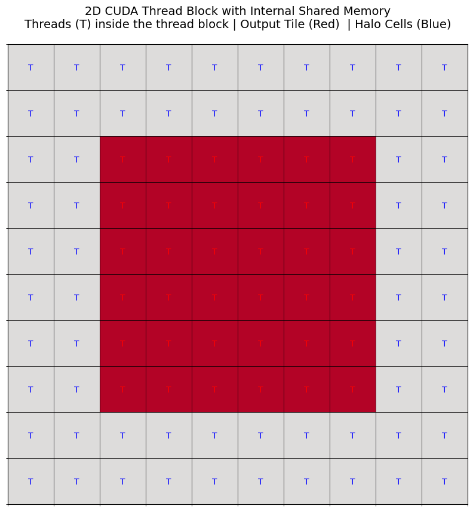
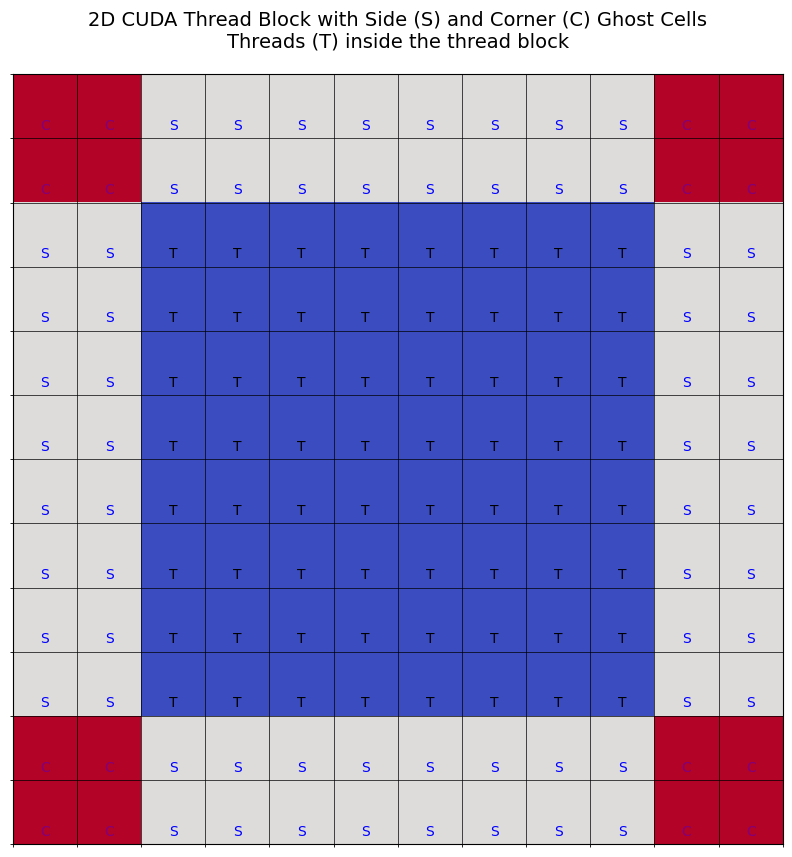

# 2D Convolution with Gaussian Blur Filter using CUDA

This educational code demonstrates 2D convolution techniques to help users understand CUDA-based optimization, particularly using shared and constant memory. The code applies a Gaussian blur filter on an image using different GPU kernel configurations for efficient processing.

The optimization techniques in this code are adapted from the following reference:

- **[1]** *Programming Massively Parallel Processors: A Hands-on Approach (4th Edition)* by David B. Kirk and Wen-mei W. Hwu

## GPU Kernel Configurations

The code performs a 2D convolution on the image’s color channels (BGR) using a Gaussian blur filter. Two shared memory configurations are used to demonstrate different optimization approaches:

1. **Configuration 1**: Shared memory size matches the thread block size, offering simplicity.

   

2. **Configuration 2**: Shared memory size is larger than the thread block, enabling better handling of boundary conditions.

   

## Input and Output Example

Below is an example of the Gaussian blur filter applied to an image:

    
    

- **Left**: The original image.
- **Right**: The image after applying the Gaussian blur filter.
