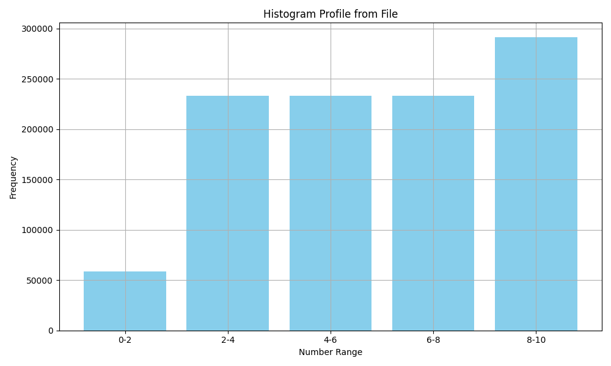

# Computing Histogram using CUDA

This educational code demonstrates techniques to compute the histogram of input data, focusing on CUDA-based optimizations, particularly through privatization and atomic operations.

The optimization techniques in this code are adapted from the following reference:

- **[1]** *Programming Massively Parallel Processors: A Hands-on Approach (4th Edition)* by David B. Kirk and Wen-mei W. Hwu

## GPU Kernel Configurations

The code computes the histogram of input data by using shared memory to reduce contention on the same memory locations and atomic operations to avoid race conditions.

## Output Example

Below is an example of the histogram computed for randomly generated input data in the range [1,10]:

